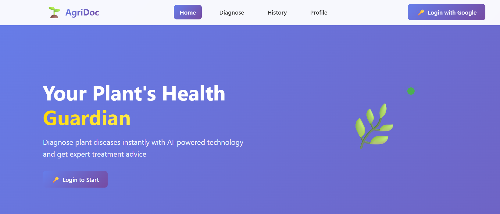
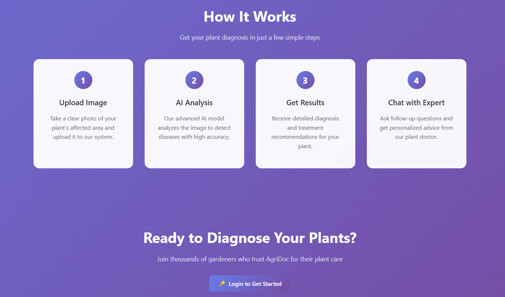
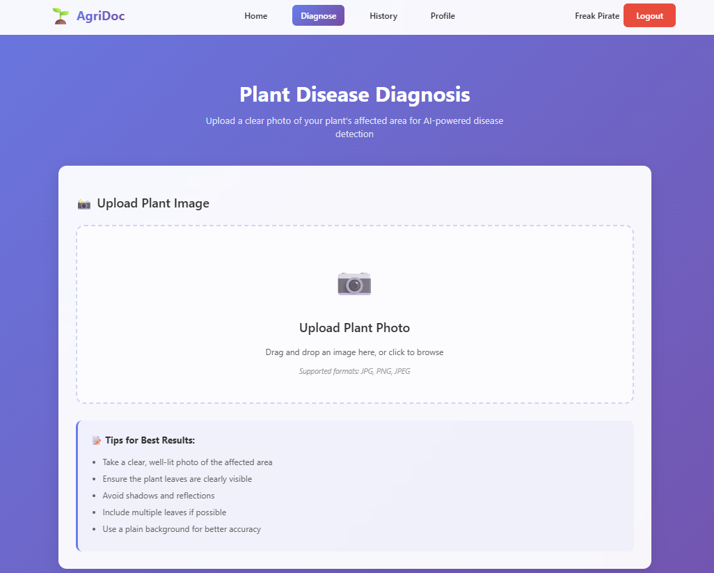
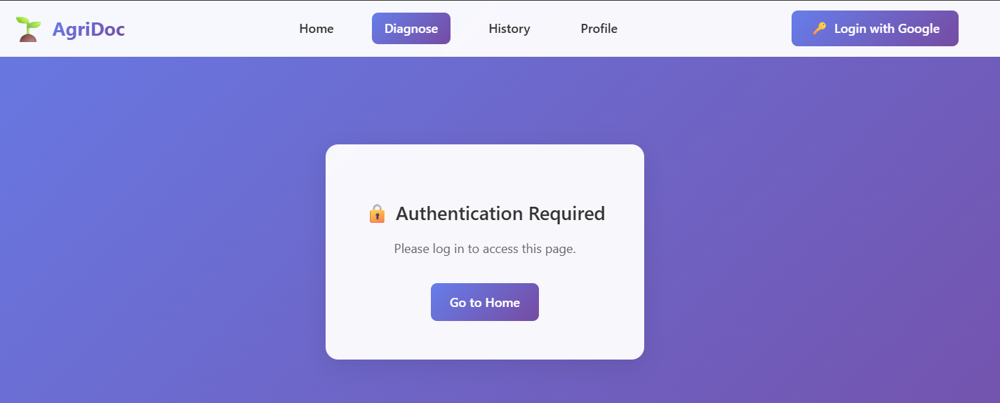
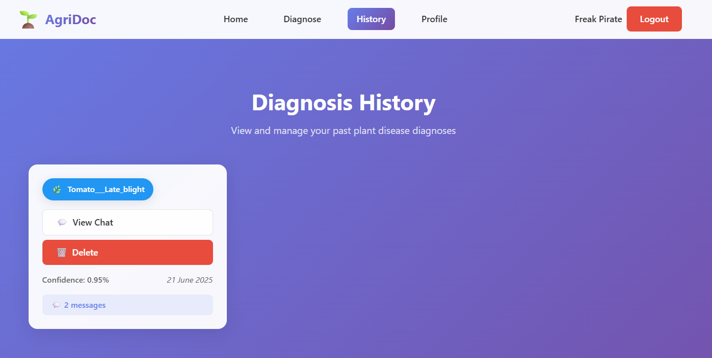
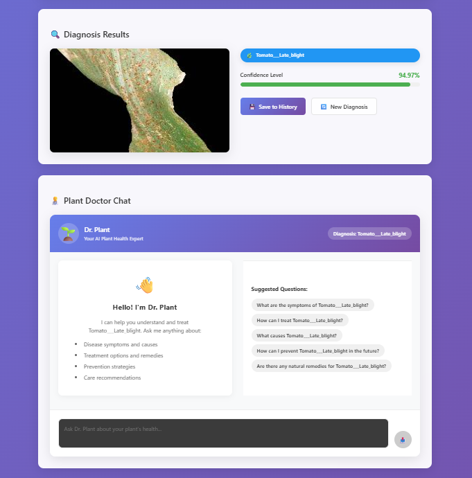

# 🌱 AgriDoc - AI-Powered Plant Disease Diagnosis

AgriDoc is a comprehensive web application that leverages artificial intelligence to diagnose plant diseases from images. Built with modern web technologies, it provides farmers, gardeners, and agricultural professionals with instant disease detection and treatment recommendations.

## 📋 Table of Contents

- [Technical Implementation](#-technical-implementation)
- [Technologies Used](#-technologies-used)
- [Screenshots](#-screenshots)
- [Installation](#-installation)
- [Usage](#-usage)
- [API Documentation](#-api-documentation)
- [Project Structure](#-project-structure)
- [Future Improvements](#-future-improvements)
- [Contributing](#-contributing)
- [License](#-license)

## 🔧 Technical Implementation

### 🤖 **Advanced Machine Learning Model**
- **CNN Architecture**: Implemented EfficientNet-B0 for optimal performance and efficiency
- **Model Performance**: Achieved **97.8% accuracy** on the testing dataset with 38 disease classes
- **TensorFlow.js Integration**: Client-side inference for real-time predictions without server latency
- **Model Optimization**: Converted and optimized TensorFlow model for web deployment
- **Transfer Learning**: Leveraged pre-trained EfficientNet weights for improved accuracy

### 🔒 **Enterprise-Grade Security**
- **Authentication**: Implemented comprehensive JWT and session-based authentication
- **Endpoint Protection**: Every API endpoint secured with authentication middleware
- **Rate Limiting**: Integrated Upstash Redis for sophisticated rate limiting (100 requests/hour per user)
- **Input Validation**: Robust validation for file uploads and user input

### 💾 **Database Architecture**
- **MongoDB Integration**: NoSQL database with Mongoose ODM for flexible data modeling
- **Chat History Storage**: Persistent storage of all user conversations with timestamps
- **User Data Management**: Secure storage of user profiles and authentication data
- **Diagnosis History**: Complete audit trail of all disease diagnoses with confidence scores

### 🔄 **Real-Time Features**
- **Live Chat System**: Real-time AI-powered agricultural consultation with LLM integration using LangChain
- **Intelligent Conversations**: Context-aware responses powered by advanced language models
- **Instant Predictions**: Sub-second disease diagnosis from image upload
- **Progressive Web App**: Responsive design with offline capabilities
- **Toast Notifications**: Real-time user feedback and status updates

### 🏗️ **Scalable Architecture**
- **Docker Containerization**: Complete containerization for consistent deployment

## 🛠️ Technologies Used

### **Frontend**
- **React 19** - Modern UI framework
- **Vite** - Fast build tool and dev server
- **React Router** - Client-side routing
- **TensorFlow.js** - Client-side ML inference
- **React Hot Toast** - User notifications

### **Backend**
- **Node.js** - JavaScript runtime
- **Express.js** - Web framework
- **MongoDB** - NoSQL database
- **Mongoose** - MongoDB ODM
- **Passport.js** - Authentication middleware
- **Multer** - File upload handling
- **Sharp** - Image processing

### **AI & Machine Learning**
- **TensorFlow** - Deep learning framework for CNN model development
- **TensorFlow.js** - Machine learning Web framework
- **LangChain** - AI/LLM orchestration
- **Groq** - High-performance LLM API
- **OpenAI** - Advanced language models

### **Infrastructure & DevOps**
- **Docker** - Containerization
- **Docker Compose** - Multi-container orchestration
- **Upstash Redis** - Rate limiting and caching
- **CORS** - Cross-origin resource sharing

### **Security & Performance**
- **Rate Limiting** - API protection
- **Session Management** - Secure authentication
- **CORS Configuration** - Security headers
- **Environment Variables** - Secure configuration

## 📸 Screenshots

### Main Dashboard

*Welcome screen with navigation and quick access to features*


*Dashboard overview with user statistics and recent activities*

### Disease Diagnosis

*Upload and analyze plant images for disease detection*

### Step-by-Step Process

*Guided workflow for accurate disease diagnosis*

### History & Reports

*View and manage previous diagnosis records*


*Comprehensive disease reports with treatment recommendations*

## 🚀 Installation

### Prerequisites
- Node.js (v18 or higher)
- MongoDB
- Docker (optional)

### Quick Start with Docker

1. **Clone the repository**
   ```bash
   git clone <https://github.com/Shivighn/AgriDoc>
   cd AgriDoc
   ```

2. **Set up environment variables**
   ```bash
   # Backend (.env)
   MONGODB_URI=your_mongodb_connection_string
   SESSION_SECRET=your_session_secret
   GOOGLE_CLIENT_ID=your_google_client_id
   GOOGLE_CLIENT_SECRET=your_google_client_secret
   OPENAI_API_KEY=your_openai_api_key
   GROQ_API_KEY=your_groq_api_key
   UPSTASH_REDIS_REST_URL=your_upstash_redis_url
   UPSTASH_REDIS_REST_TOKEN=your_upstash_redis_token
   ```

3. **Run with Docker Compose**
   ```bash
   docker-compose up --build
   ```

### Manual Installation

1. **Backend Setup**
   ```bash
   cd backend
   npm install
   npm run dev
   ```

2. **Frontend Setup**
   ```bash
   cd frontend
   npm install
   npm run dev
   ```

## 📖 Usage

1. **Authentication**: Sign in using Google OAuth or create a local account
2. **Upload Image**: Navigate to the Diagnose page and upload a plant image
3. **Get Results**: Receive instant disease diagnosis with confidence scores
4. **Chat Assistant**: Ask questions about plant care and treatment
5. **View History**: Check your diagnosis history and track progress

## 📚 API Documentation

For detailed API documentation, including all endpoints, request/response formats, and authentication methods, please refer to:

**[API Documentation](API_Documentation.txt)**

The API documentation covers:
- Authentication endpoints
- Disease diagnosis API
- Chat assistant endpoints
- User profile management
- History tracking
- Error handling

## 📁 Project Structure

```
AgriDoc/
├── backend/                 # Node.js/Express server
│   ├── src/
│   │   ├── config/         # Database and external service configs
│   │   ├── middleware/     # Rate limiting and security
│   │   ├── models/         # MongoDB schemas and ML models
│   │   ├── routes/         # API endpoints
│   │   ├── utils/          # Helper functions
│   │   └── server.js       # Main server file
│   ├── uploads/            # Image storage
│   └── Dockerfile
├── frontend/               # React application
│   ├── src/
│   │   ├── components/     # Reusable UI components
│   │   ├── contexts/       # React contexts
│   │   ├── pages/          # Page components
│   │   └── assets/         # Static assets
│   └── Dockerfile
├── Reference/              # Screenshots and documentation
├── docker-compose.yml      # Multi-container setup
└── README.md
```

## 🔮 Future Improvements

### 🌍 **Multi-Language Support**
- **Language Translation**: Implement real-time translation for multiple languages

### 🔬 **Enhanced Disease Detection**
- **Expanded Disease Classes**: Support for 100+ additional plant diseases
- **Symptom Analysis**: Multi-symptom detection and correlation
- **Disease Progression Tracking**: Monitor disease development over time

### 🤖 **Advanced AI Chat with RAG**
- **Retrieval-Augmented Generation (RAG)**: Enhanced chat using comprehensive agricultural knowledge base
- **Image-Based Chat**: Upload images during conversations for better assistance
- **Treatment Tracking**: Monitor treatment effectiveness and suggest adjustments

### 📱 **Mobile Application**
- **Native Mobile Apps**: iOS and Android applications
- **Offline Capabilities**: Basic diagnosis without internet connection
- **Push Notifications**: Alerts for disease outbreaks and treatment reminders

### 📊 **Advanced Analytics**
- **Predictive Analytics**: Forecast disease outbreaks based on environmental data
- **Community Insights**: Anonymous data sharing for regional disease tracking
- **Performance Metrics**: Detailed accuracy and usage statistics

### 🔗 **Integration Capabilities**
- **IoT Sensors**: Integration with soil and weather sensors
- **Drone Imagery**: Support for aerial plant health monitoring
- **Farm Management Systems**: Integration with existing agricultural software

## 🤝 Contributing

We welcome contributions! Please see our contributing guidelines for details on how to submit pull requests, report issues, and contribute to the project.

## 📄 License

This project is licensed under the MIT License - see the LICENSE file for details.

---

**AgriDoc** - Empowering farmers with AI-driven plant disease diagnosis and agricultural intelligence. 🌱🤖 